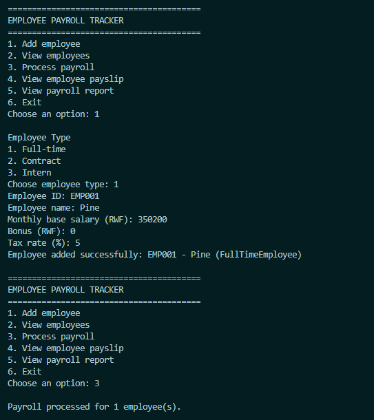
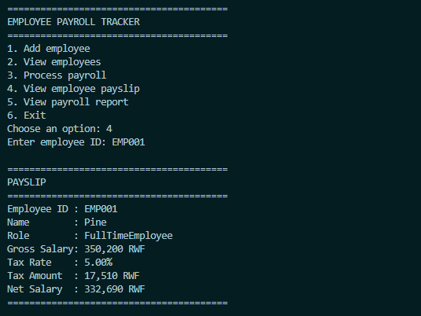
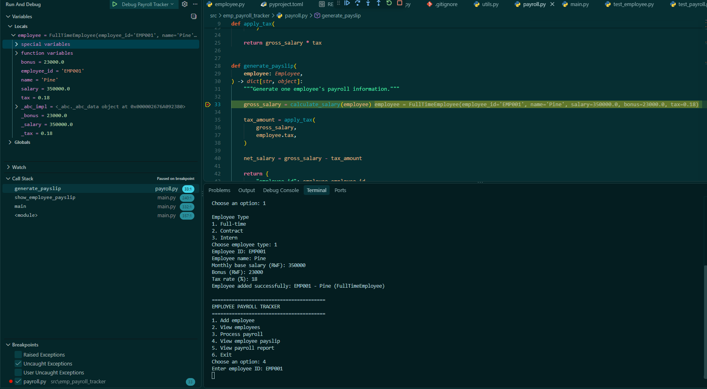

# Employee Payroll Tracker

A command-line Employee Payroll Tracker developed as part of
the Python Basics module.

The application manages different employee categories and
calculates their gross salary, tax deductions, and net salary.

## Employee Types

- Full-Time Employee
- Contract Employee
- Intern

## Features

- Add employees
- View employee records
- Process payroll
- Generate payslips
- Generate payroll reports
- Validate salary, bonus, and tax values
- Role-specific salary calculation
- Error handling for invalid input

## Python Concepts Demonstrated

- Variables and data types
- Arithmetic operators
- Lists
- Dictionaries
- Loops
- Conditional statements
- Functions
- Modules
- Exception handling
- Type hints
- Object-Oriented Programming
- Inheritance
- Encapsulation
- Abstraction
- Polymorphism
- Property decorators
- Method overriding
- Dunder methods
- Dictionary comprehensions

## Project Structure

```text
emp-payroll-tracker/
│
├── docs/
│   └── images/
│       ├── app-menu.png
│       ├── payslip_report.png
│       └── debugger_view.png
│
├── src/
│   └── emp_payroll_tracker/
│       ├── __init__.py
│       ├── employee.py
│       ├── payroll.py
│       ├── utils.py
│       └── main.py
│
├── tests/
│   ├── __init__.py
│   ├── test_employee.py
│   └── test_payroll.py
│
├── .gitignore
├── pyproject.toml
├── poetry.lock
└── README.md

```

---

# Setup Instructions

## 1. Prerequisites

Before running the project, make sure the following are installed:

- Python 3.11 or later
- Poetry
- Git
- VS Code, PyCharm, or another Python IDE

Check your Python version:

```bash
python --version
```

or on Windows:

```bash
py --version
```

Check whether Poetry is installed:

```bash
poetry --version
```

If Poetry is installed correctly, the command should display the installed Poetry version.

---

## 2. Clone the Repository

Clone the project from GitHub:

```bash
git clone <your-repository-url>
```

Move into the project directory:

```bash
cd emp-payroll-tracker
```


---

## 3. Install Project Dependencies

This project uses Poetry for dependency and virtual environment management.

Install the project dependencies:

```bash
poetry install
```

Poetry will automatically create or use a virtual environment and install the dependencies defined in `pyproject.toml` and `poetry.lock`.

You can inspect the Poetry environment using:

```bash
poetry env info
```

---

## 4. Run the Application

From the project root directory, run:

```bash
poetry run python -m emp_payroll_tracker.main
```

The application menu should appear in the terminal.

Example:

```text
========================================
EMPLOYEE PAYROLL TRACKER
========================================
1. Add employee
2. View employees
3. Process payroll
4. View employee payslip
5. View payroll report
6. Exit

Choose an option:
```

---

## 5. Run the Automated Tests

The project uses `pytest` for automated testing.

Run all tests with:

```bash
poetry run pytest
```

A successful test run should display output similar to:

```text
collected 9 items

tests/test_employee.py ......
tests/test_payroll.py ...

9 passed
```

The exact number of tests may increase as more test cases are added.

---

## 6. Run Tests With Coverage

If `pytest-cov` is installed, coverage can be checked with:

```bash
poetry run pytest --cov=emp_payroll_tracker --cov-report=term-missing
```

This displays:

- Number of statements
- Number of missed statements
- Coverage percentage
- Lines not covered by tests

---

# Application Usage

## Adding an Employee

Select:

```text
1. Add employee
```

The application asks which type of employee should be created:

```text
1. Full-time
2. Contract
3. Intern
```

The user then provides the required employee information.

Example:

```text
Employee ID: EMP001
Employee name: Alice
Monthly base salary (RWF): 500000
Bonus (RWF): 50000
Tax rate (%): 10
```

---

## Viewing Employees

Select:

```text
2. View employees
```

The application displays registered employees.

Example:

```text
EMPLOYEES
------------------------------------------------------------
EMP001    Alice               FullTimeEmployee
EMP002    Bob                 ContractEmployee
EMP003    Chris               Intern
```

---

## Processing Payroll

Select:

```text
3. Process payroll
```

The application processes all employees currently stored in the employee list.

Each employee's salary is calculated according to their employee type.

The results are stored in a dictionary using the employee ID as the key.

Conceptually:

```python
{
    "EMP001": {
        "employee_id": "EMP001",
        "name": "Alice",
        "role": "FullTimeEmployee",
        "gross_salary": 550000,
        "tax_amount": 55000,
        "net_salary": 495000
    }
}
```

---

## Viewing an Employee Payslip

Select:

```text
4. View employee payslip
```

Enter the employee ID.

Example:

```text
Enter employee ID: EMP001
```

The application generates a payslip similar to:

```text
========================================
PAYSLIP
========================================
Employee ID : EMP001
Name        : Alice
Role        : FullTimeEmployee
Gross Salary: 550,000.00 RWF
Tax Rate    : 10.00%
Tax Amount  : 55,000.00 RWF
Net Salary  : 495,000.00 RWF
========================================
```

---

## Viewing the Payroll Report

Select:

```text
5. View payroll report
```

The application displays payroll information for all employees whose payroll has been processed.

---

# Salary Calculation Rules

The salary formulas used in this project are simplified rules created for the purpose of demonstrating Python programming concepts.

They should not be considered official payroll or tax regulations.

---

## Full-Time Employee

A full-time employee receives a fixed salary plus any bonus.

```text
Gross Salary = Base Salary + Bonus
```

Example:

```text
Base Salary = 500,000 RWF
Bonus       = 50,000 RWF

Gross Salary = 550,000 RWF
```

---

## Contract Employee

A contract employee is paid according to the number of contract days worked.

First, the daily rate is calculated:

```text
Daily Rate = Contract Salary / Total Contract Days
```

Then:

```text
Gross Salary = Daily Rate × Days Worked + Bonus
```

Example:

```text
Contract Salary   = 300,000 RWF
Contract Days     = 30
Days Worked       = 15
Bonus             = 10,000 RWF

Daily Rate = 300,000 / 30
           = 10,000 RWF

Gross Salary = 10,000 × 15 + 10,000
             = 160,000 RWF
```

---

## Intern

An intern receives a stipend, optional bonus, and transport allowance.

```text
Gross Salary = Stipend + Bonus + Transport Allowance
```

Example:

```text
Stipend             = 100,000 RWF
Bonus               = 5,000 RWF
Transport Allowance = 20,000 RWF

Gross Salary = 125,000 RWF
```

---

# Tax Calculation

Tax is stored internally as a decimal.

For example:

```text
10% = 0.10
```

The tax amount is calculated using:

```text
Tax Amount = Gross Salary × Tax Rate
```

Example:

```text
Gross Salary = 550,000 RWF
Tax Rate     = 10%

Tax Amount = 550,000 × 0.10
           = 55,000 RWF
```

---

# Net Salary Calculation

The employee's final salary after tax deduction is:

```text
Net Salary = Gross Salary - Tax Amount
```

Example:

```text
Gross Salary = 550,000 RWF
Tax Amount   = 55,000 RWF

Net Salary = 495,000 RWF
```

---

## Application Screenshots

### Main Menu




### Generated Payslip




### Debugging Demonstration


